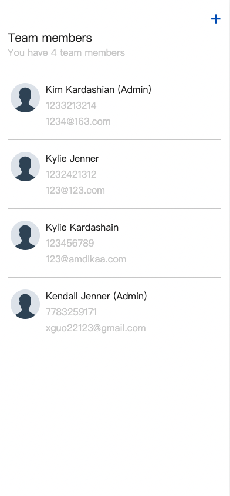

# instawork_project

This is a simple team-member management application that allows the user to view, edit, add, and delete team members. 

How to start the project:
```commandline
cd team_management

// This will start the development server, which could be accessed by visiting http://127.0.0.1:8000/ in your web browser.
python manage.py runserver 
```

## List Page:



1. the subtitle reflect the number of team members
2. if the team member is an admin, that is listed next to their name. 
3. Clicking a team member will show the Edit page. 
4. Clicking the plus at the top will show the Add page.

## Edit Page:

1. Clicking save edits the team member information and shows the List page. 
2. Clicking Delete removes the team member and returns to the List page.

## Add Page:

1. the team member's role is default to regular
2. Hitting save adds the team member to the list and shows the List page.


## Others:
### 1. validation:


## Future Improvements:

1. Validation: 
I plan to improve the validation process to make it more robust and ensure the data being processed is accurate and consistent.

2. Paging: 
To improve the user experience, I plan to add paging to the start page of the project which will allow for better navigation and faster processing of data.

3. User Interface:
In order to make the project more accessible and user-friendly, I plan to add more UI elements and improvements to enhance the overall user experience.

4. Testing:
I plan to implement automated testing to increase the efficiency of the testing process and ensure that the project remains stable and reliable over time

## Estimated time spent

Based on my initial assessment, I estimate that I spent a total of 12 hours on the project, including 4 hours dedicated to gaining a basic understanding of the Django framework and 8 hours dedicated to working on the project itself.